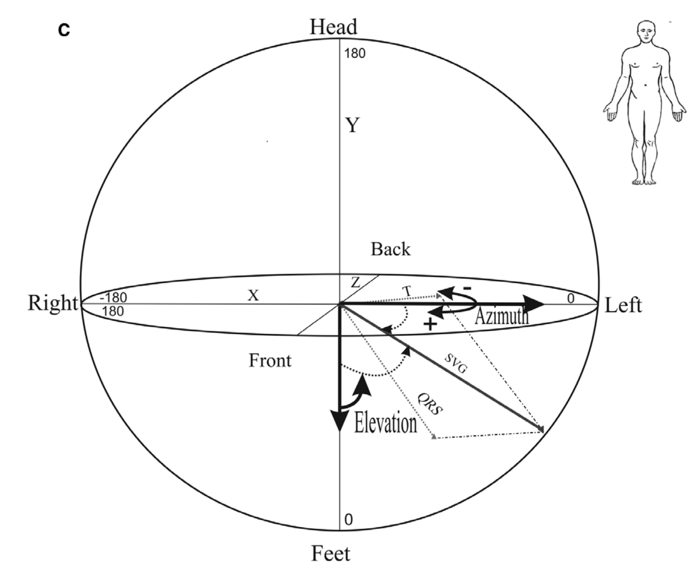

# Vectorcardiography {#vcg}

## Vector Gradients

Mark Josephson in 1988 found that repolarization became non-uniform post-infarction, which was the suggestive substrate of VT/VF.

The dispersion of the total recovery time is suggestive of global electrical heterogeneity, which can then predict SCD.

Vectorcardiography (VCG) characterizes the electrical heart vector movement through a cardiac cycle. This is understood best through the spatial ventricular gradient vector (SVG), as described by Frank Wilson in 1934, and expanded upon by J. Willis Hurst. This is different and independent of the sequence of ventricular activation, which can be seen on ECG. The work by Larisa Tereschchenko has helped to compute these concepts for analytical approaches [@Tereshchenko2018a]. The SVG points to different locations in healthy versus diseased hearts.

[Summary of SVG](https://youtu.be/vsXuJvhRkYA):

1. Points along the direction of greatest activation and recovery time (which is perpendicular to the line of conduction block, such as scar)
1. Points towards to the area where the total recovery time is the shortest
1. Depends on the heterogeneity of action potential across entire myocardium
1. Characterizes the degree of heterogeneity of recovery time across the ventricles
1. Steepness of the gradient determines magnitude of the SVG (areas of contrasting recovery time thus give largest SVG)

## Global Electrical Heterogeneity

The SVG can be broken down in 5 VCG parameters to describe the overall global electrical heterogeneity of the heart, as seen in the __Figure__ below [@Waks2016a].

- SVG magnitude
- SVG azimuth 
- SVG elevation 
- Spatial QRS-T angle = the three-dimensional angle between mean spatial QRS-vector and mean spatial T-vector, measured in degrees
- Sum absolute QRST integral = scalar analog of the SVG, calculated as absolute value under QRS cmplex and T-wave, measured in millivolts (integral of voltage over time)

